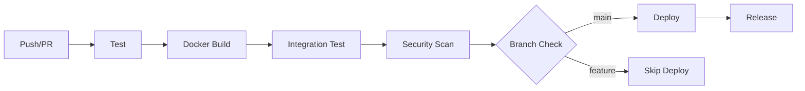

# Docker & CI/CD Implementation

## 🐳 Docker Containerization

### Multi-Stage Dockerfile

The scanner uses a multi-stage Docker build for optimal image size and functionality:

```dockerfile
# Stage 1: Scanner Base (Ubuntu 22.04)
FROM ubuntu:22.04 AS scanner-base
# - Core scanner components
# - Bash scripts and modules
# - Minimal runtime dependencies

# Stage 2: Web Application
FROM scanner-base AS webapp
# - Flask web interface
# - Python dependencies
# - SQLite database
# - Production-ready setup

# Stage 3: Test Environment
FROM scanner-base AS test-env
# - Testing tools (pytest, shellcheck)
# - Development dependencies
# - Test execution environment
```

### Docker Images

| Target | Purpose | Size | Use Case |
|--------|---------|------|----------|
| `webapp` | Full web application | ~150MB | Production deployment |
| `scanner-cli` | Command-line only | ~50MB | CLI usage |
| `test-env` | Testing environment | ~120MB | CI/CD pipelines |

### Quick Start with Docker

```bash
# Build the image
docker build -t linux-scanner .

# Run web interface
docker run -p 5000:5000 linux-scanner

# Run CLI scan
docker run linux-scanner ./scanner.sh filesystem

# Run tests
docker run linux-scanner ./tests/test_scanner.sh
```

## 🔄 CI/CD Pipeline

### GitHub Actions Workflow

The CI/CD pipeline includes comprehensive testing and deployment:

#### Jobs Overview

1. **Test Job** - Multi-Python version testing
2. **Docker Build** - Multi-platform image building
3. **Integration Test** - Docker Compose testing
4. **Security Scan** - Vulnerability assessment
5. **Deploy** - Staging environment deployment
6. **Release** - Automated releases

#### Pipeline Stages



### Testing Strategy

#### Unit Tests
- **Python**: Flask application testing with pytest
- **Bash**: Script syntax validation with shellcheck
- **Integration**: Cross-component testing

#### Docker Tests
- **Container Build**: Multi-stage build validation
- **Image Security**: Vulnerability scanning with Trivy
- **Runtime Tests**: Container execution validation

#### Integration Tests
- **Web Interface**: HTTP endpoint testing
- **Database**: SQLite operations validation
- **File I/O**: Results storage and retrieval

### Quality Gates

| Gate | Criteria | Action |
|------|----------|--------|
| **Build** | Dockerfile syntax valid | Fail pipeline |
| **Test** | Unit tests pass (80% coverage) | Fail pipeline |
| **Security** | No critical vulnerabilities | Block deployment |
| **Integration** | All services start successfully | Rollback |

## 🚀 Deployment Options

### Docker Compose (Development)

```yaml
version: '3.8'
services:
  scanner:
    build: .
    ports:
      - "5000:5000"
    volumes:
      - ./results:/opt/scanner/results
```

### Production Deployment

#### Option 1: Docker Swarm
```bash
docker stack deploy -c docker-compose.prod.yml scanner
```

#### Option 2: Kubernetes
```yaml
apiVersion: apps/v1
kind: Deployment
metadata:
  name: linux-scanner
spec:
  replicas: 3
  selector:
    matchLabels:
      app: linux-scanner
  template:
    metadata:
      labels:
        app: linux-scanner
    spec:
      containers:
      - name: scanner
        image: ghcr.io/your-org/linux-scanner:latest
        ports:
        - containerPort: 5000
```

#### Option 3: Cloud Platforms

**AWS ECS:**
```bash
aws ecs create-service \
  --cluster scanner-cluster \
  --service-name scanner-service \
  --task-definition scanner-task \
  --desired-count 2
```

**Google Cloud Run:**
```bash
gcloud run deploy scanner \
  --image ghcr.io/your-org/linux-scanner:latest \
  --platform managed \
  --port 5000
```

## 🔒 Security Considerations

### Container Security
- **Non-root user**: Scanner runs as `scanner` user
- **Minimal base image**: Ubuntu 22.04 with minimal packages
- **No secrets in image**: Configuration via environment variables
- **Regular updates**: Automated dependency updates

### Pipeline Security
- **Dependency scanning**: Automated vulnerability detection
- **Secret management**: GitHub Secrets for credentials
- **Branch protection**: Required reviews for main branch
- **Audit logging**: Complete pipeline execution logs

### Runtime Security
- **Network isolation**: Container network segmentation
- **Resource limits**: CPU and memory constraints
- **Health monitoring**: Automated container health checks
- **Log aggregation**: Centralized logging collection

## 📊 Monitoring & Observability

### Application Metrics
- **Scan statistics**: Success rates, duration, error counts
- **User activity**: Page views, feature usage
- **Performance**: Response times, resource usage
- **Security events**: Failed scans, suspicious activity

### Infrastructure Monitoring
- **Container health**: Docker health checks
- **Resource usage**: CPU, memory, disk I/O
- **Network traffic**: Request/response patterns
- **Error rates**: Application and infrastructure errors

### Logging Strategy
```
Application Logs → Fluentd → Elasticsearch → Kibana
├── Web requests
├── Scan operations
├── Security events
└── Error conditions
```

## 🔄 Rollback Strategy

### Automated Rollback
```yaml
# GitHub Actions rollback job
rollback:
  if: failure() && github.ref == 'refs/heads/main'
  runs-on: ubuntu-latest
  steps:
    - name: Rollback deployment
      run: |
        # Deploy previous known good version
        docker tag scanner:previous scanner:latest
        docker-compose up -d
```

### Manual Rollback
```bash
# Quick rollback to previous version
docker tag scanner:v1.0.0 scanner:latest
docker-compose up -d

# Rollback to specific commit
git checkout <commit-hash>
docker build -t scanner:rollback .
docker tag scanner:rollback scanner:latest
```

## 📈 Performance Optimization

### Docker Optimization
- **Multi-stage builds**: Reduced final image size
- **Layer caching**: Optimized build times
- **Alpine variants**: Smaller base images where possible
- **Distroless images**: Minimal runtime images for production

### Application Optimization
- **Background processing**: Non-blocking scan execution
- **Result caching**: Frequently accessed data caching
- **Pagination**: Efficient large dataset handling
- **Async operations**: Concurrent request processing

### CI/CD Optimization
- **Parallel jobs**: Concurrent test execution
- **Caching**: Dependency and build artifact caching
- **Incremental builds**: Only rebuild changed components
- **Test selection**: Run only affected tests

## 🎯 Success Metrics

### Pipeline Health
- **Build success rate**: >95%
- **Test pass rate**: >98%
- **Deployment success rate**: >99%
- **Mean time to recovery**: <15 minutes

### Application Performance
- **Scan completion time**: <5 minutes average
- **Web response time**: <500ms P95
- **Container startup time**: <30 seconds
- **Concurrent users**: >50 simultaneous

### Security Posture
- **Vulnerability detection**: Zero critical issues
- **Compliance score**: >85% average
- **False positive rate**: <5%
- **Time to detect**: <24 hours

## 🚀 Future Enhancements

### Advanced CI/CD
- **Multi-environment deployments**: Dev → Staging → Production
- **Blue-green deployments**: Zero-downtime updates
- **Canary releases**: Gradual rollout with monitoring
- **Feature flags**: Runtime feature toggling

### Enhanced Testing
- **Performance testing**: Load testing with k6
- **Chaos engineering**: Failure injection testing
- **Contract testing**: API compatibility validation
- **Visual regression**: UI consistency testing

### Observability
- **Distributed tracing**: End-to-end request tracking
- **Custom metrics**: Business KPI monitoring
- **Alerting**: Proactive issue detection
- **Dashboards**: Real-time monitoring views

---

## 🛠️ Quick Commands

```bash
# Local development
make build          # Build Docker images
make test           # Run test suite
make webapp         # Start web interface
make clean          # Clean up resources

# Docker operations
docker build -t scanner .                    # Build image
docker run -p 5000:5000 scanner             # Run webapp
docker-compose up -d                        # Start services
docker-compose --profile test up -d         # Run tests

# CI/CD operations
gh workflow run ci-cd.yml                   # Trigger pipeline
gh run list                                 # View pipeline runs
gh run view <run-id>                        # View run details
```

**Containerized CI/CD pipeline successfully implemented! 🎉**

The scanner now has enterprise-grade containerization and automated testing/deployment pipelines, ready for production use across any infrastructure that supports Docker.
